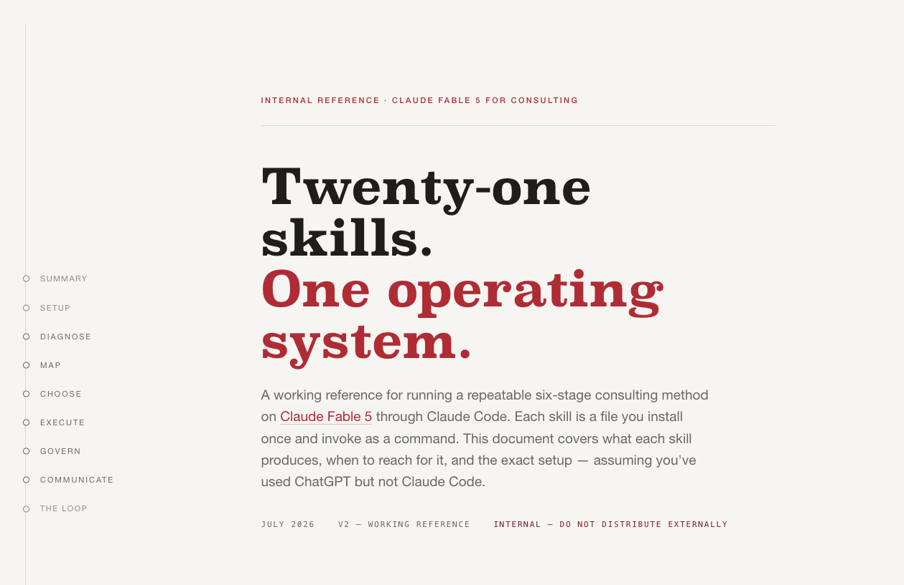

# Fable Consulting OS

A single-page working reference for running a repeatable six-stage consulting method — **Diagnose → Map → Choose → Execute → Govern → Communicate** — on Claude Fable 5 through Claude Code. Each stage has 3–4 skills: packaged methods with a fixed output format, installed once as files and invoked as slash commands. The page covers what each of the twenty-one skills produces, when to reach for it, and the exact setup, assuming you've used ChatGPT but not Claude Code.s

 
